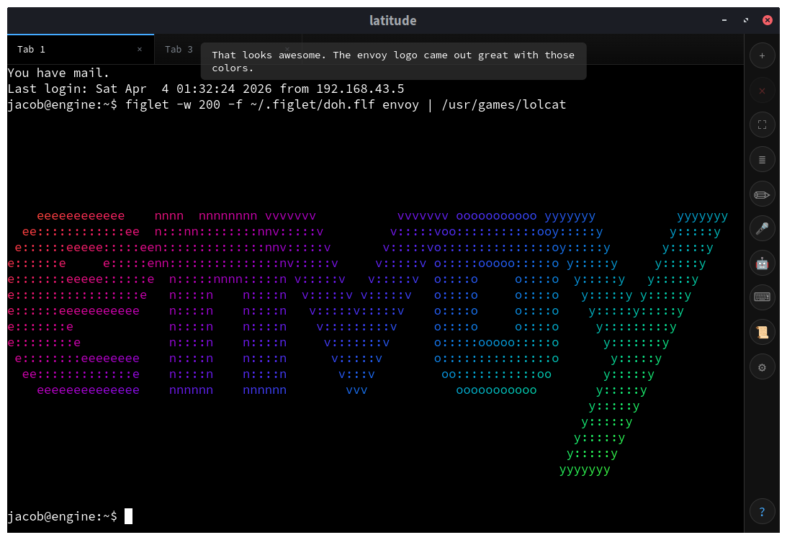

<p align="center">
  <picture>
    
  </picture>
</p>

<h1 align="center">envoy</h1>

<p align="center">
  A terminal emulator with a built-in voice &amp; text AI agent.<br>
  Runs as a <strong>web app</strong> or a native <strong>desktop app</strong> &mdash; same codebase, same features.
</p>



---

## Features

- **Full terminal emulation** &mdash; xterm.js with 256-color support, scrollback, and bracketed paste
- **Multi-tab sessions** &mdash; open, close, and switch between independent terminal tabs
- **Voice agent** &mdash; hold a button and talk; the agent sees your terminal, runs commands, and speaks back
- **Text agent** &mdash; type a message instead; same capabilities, no microphone needed
- **Dictation** &mdash; voice-to-text transcription pasted directly into the terminal
- **Drag-and-drop file upload** &mdash; drop a file onto the terminal and its path is inserted at the cursor
- **Aliases** &mdash; map URL paths to shell commands via `aliases.conf`
- **PWA support** &mdash; installable from the browser with offline caching
- **Dark theme** &mdash; designed for extended terminal use

## Architecture

```
Browser / pywebview
  ├── xterm.js          terminal emulation
  ├── app.js            tabs, voice, drag-drop, settings
  └── transport layer
        ├── PywebviewTransport   (desktop: JS ↔ Python bridge)
        └── BrowserTransport     (web: HTTP JSON to server.py)

Python backend
  ├── app_core.py       PTY session management, file uploads
  ├── voice_chat.py     Gemini agent with terminal tools
  ├── speech.py         Inworld TTS synthesis
  ├── agent.py          Gemini tool-calling runtime
  └── env_config.py     API key management
```

Both modes share the same runtime (`app_core.py`) and frontend (`app.js`). The only difference is the transport layer.

## Quickstart

### Web mode

```bash
uv venv .venv
uv pip install --python .venv/bin/python -r requirements-web.txt
python server.py
```

Open `http://localhost:8080/envoy/`

### Desktop mode

```bash
uv venv .venv
uv pip install --python .venv/bin/python -r requirements-desktop.txt
./envoy-desktop
```

An optional launch target can open a specific alias or path:

```bash
./envoy-desktop /python        # resolved via aliases.conf
./envoy-desktop /projects/foo  # resolved relative to $HOME
```

## API Keys

Voice and agent features require API keys. Set them as environment variables, in a `.env` file, or through the in-app settings dialog.

| Key | Required for |
|-----|-------------|
| `GOOGLE_API_KEY` | Voice & text agent (Gemini) |
| `GROQ_API_KEY` | Dictation (Whisper) |
| `INWORLD_API_KEY` | Spoken agent responses (TTS) |

The terminal itself works without any keys configured.

## Keyboard Shortcuts

| Shortcut | Action |
|----------|--------|
| `Ctrl+T` | New tab |
| `Ctrl+W` | Close tab |
| `Ctrl+Tab` | Next tab |
| `Ctrl+\` | Toggle toolbar |
| `Ctrl+Shift+Space` | Voice agent |
| `Ctrl+Shift+E` | Text agent / paste editor |
| `Ctrl+Shift+0` / `+` / `-` | Reset / increase / decrease font size |

## License

MIT
